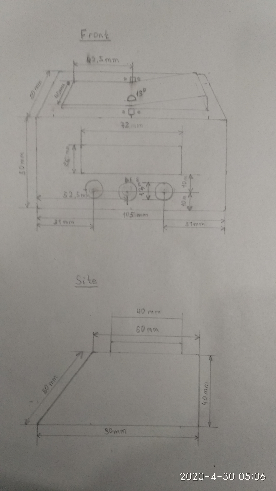
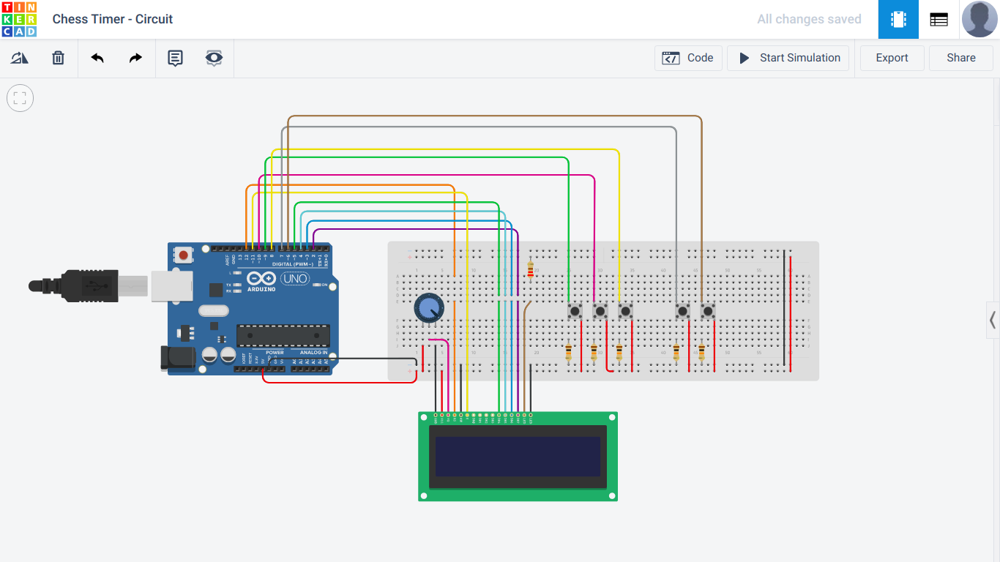

## Project description
Main goal of this project is to demonstrate usage of Arduino with 3D printing to make real world things 
and of course make chess players happy.

## Team (authors)
* Nurbol Chorobaev
* Doslan Zheksheev
* Bekzhol Zholdubai uulu
* Bektur Rahmatali uulu

## Parts list

| Amount | Part |
|--------|------|
| 1      | LCD screen 16x2|
| 1      | Arduino Uno (Rev3) |
| 1      | Potentiometer |
| 1      | 220Ω Resistor |
| 5      | 10kΩ Resistor |
| 5      | Pushbutton |
| 1      | Pushbutton switching circuit SPST |
| 1      | Battery block 9V |

