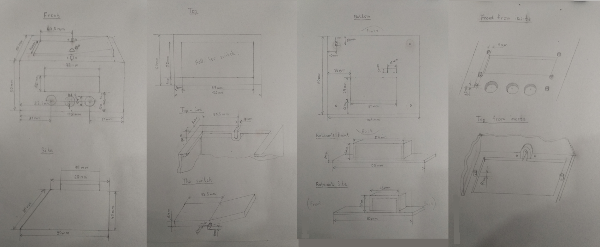
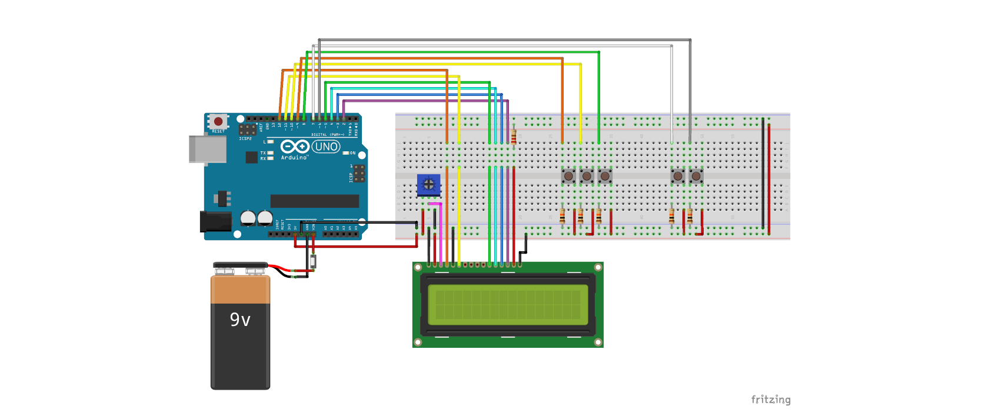
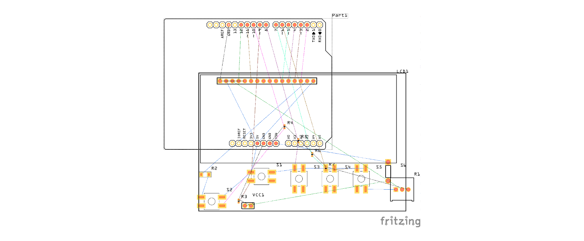

## Project description
Main goal of this project is to demonstrate usage of Arduino with 3D printing 
to make real world things and of course make chess players happy.
The project was develop for educational purpose.

[][1]

## Team (authors)
* Nurbol Chorobaev
* Doslan Zheksheev
* Bekzhol Zholdubai uulu
* Bektur Rahmatali uulu

## Development
 _Used drawings with all dimensions._

 _Circuit schema from Fritzing._

 _PCP from Fritzing_.

Demonstration video is [here](https://youtu.be/TPOspKETKMQ).

Tinkercad project is [here](https://www.tinkercad.com/things/bRu6NNPJVqT-chess-timer-circuit).

Also checkout "[Chess timer][2]" project on this repository to see the
issues into which the project was divided.  

## Parts list

| Amount | Part |
|--------|------|
| 1      | LCD screen 16x2|
| 1      | Arduino Uno (Rev3) |
| 1      | Potentiometer |
| 1      | 220Ω Resistor |
| 5      | 10kΩ Resistor |
| 5      | Pushbutton |
| 1      | Pushbutton switching circuit SPST |
| 1      | Battery block 9V |

**P.S:** A lot thanks to our Engineering Computer Science course instructor, Ruslan Isaev,
for guidance and great patient!

[1]: http://www.alatoo.edu.kg/
[2]: https://github.com/chorobaev/arduino-chess-clock/projects/1
